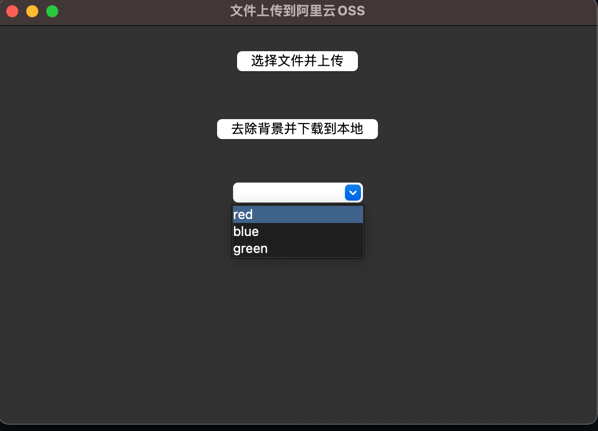

# remove_bg
解决突然需要证件照的问题
```shell
cp .env.sample .env
```
修改.env文件中的配置
```shell
REMOVE_BG_API_KEY=remove.bg api key
ALIYUN_ENDPOINT= oss endpoint
STS_ACCESS_KEY_ID= 
STS_ACCESS_KEY_SECRET=
OSS_ACCESS_KEY_ID=
OSS_ACCESS_KEY_SECRET=
ALIYUN_BUCKET=
ALIYUN_ROLE_ARN=
```
目前需要配置的是你sts角色的key和id，以及oss的key和id，以及bucket的名字，以及endpoint

安装依赖

```shell
pip install -r requirements.txt
```
运行

```shell
python -m src.main
```
选择图片，然后就会自动上传到oss，然后选择需要替换的背景（默认:透明）自动调用remove.bg的api，图片（默认:no-bg.png）生成在根目录

